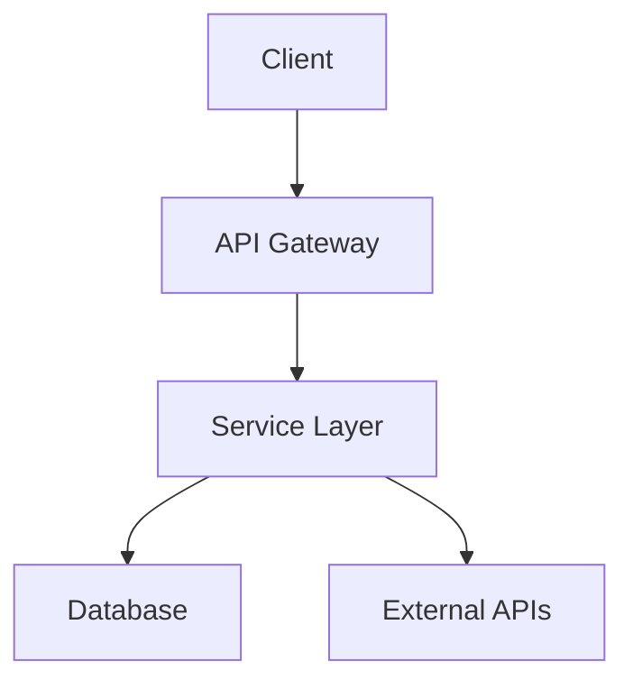

# Architecture

## High-Level Overview

<!-- Replace the diagram above with your actual system architecture -->

## Key Components

<!-- Describe each major component and its responsibility -->

## Data Flow

<!-- Describe how data moves through the system -->
